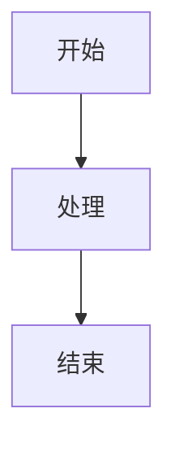

# Anki Markdown Template

一套可直接复制到 Anki 的卡片模板，支持 Markdown 渲染、代码高亮、数学公式和 Mermaid 图表。

本项目从 [`qrkks/useful-scripts`](https://github.com/qrkks/useful-scripts) 独立出来，以便单独维护和发布。

## 文件说明

- `front.html` - 卡片正面模板
- `back.html` - 卡片背面模板
- `css.html` - 粘贴到 Anki“样式”区域的 CSS 和 JavaScript

## 功能特性

- ✅ **Markdown 支持**：完整的 Markdown 语法支持
- ✅ **代码高亮**：支持多种编程语言的语法高亮
- ✅ **数学公式**：支持 LaTeX 数学公式渲染（KaTeX）
- ✅ **Mermaid 图表**：支持流程图、时序图等图表渲染
- ✅ **暗黑模式**：自动适配 Anki 的暗黑模式
- ✅ **代码复制**：点击代码块标签可快速复制代码
- ✅ **响应式设计**：适配不同屏幕尺寸

## 使用方法

1. 下载或克隆本仓库
2. 打开 Anki，进入 **工具 → 管理笔记类型**
3. 选择要使用的笔记类型，点击 **卡片...**
4. 将 `front.html` 的内容复制到 **正面模板**
5. 将 `back.html` 的内容复制到 **背面模板**
6. 将 `css.html` 的内容复制到 **样式**
7. 保存后先用测试卡片确认显示效果

## 注意事项

- 首次使用需要网络连接以加载必要的资源库（CDN）
- 部分功能依赖外部 CDN，离线环境可能无法正常工作
- 建议在测试卡片中验证功能后再批量使用

## 支持的语法

### Markdown

- 标题、列表、链接、图片等标准 Markdown 语法
- 代码块和行内代码
- 表格
- 强调和加粗

### 数学公式

- 行内公式：`$公式$`
- 块级公式：`$$公式$$`

### Mermaid 图表

使用代码块语法，语言指定为 `mermaid`：

````markdown

````

### 代码高亮

使用代码块语法，指定语言名称：

````markdown
```python
def hello():
    print("Hello, World!")
```
````

## 许可证

本模板采用 [MIT License](LICENSE)。

